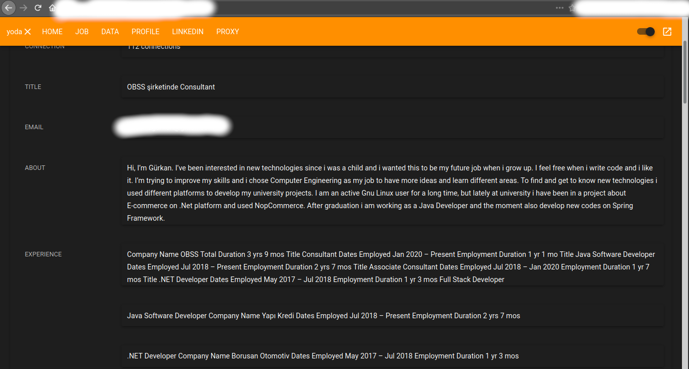

# DENT

LinkedIn sistemi üzerinde yer alan profil bilgilerini crawl eden sistemin genel ismi DENT olarak isimlendirilmiştir. **DENT** toplamda 4 uygulama olmak üzere **DENT UI**, **DENT BFF**, **DENT CRAWLER** ve **DENT IEXT** olarak isimlendirilmiştir. Herhangi bir ticari amaç veya kullanım için yapılmamış olup sadece ilgili teknolojilerin kullanımı için yapılmıştır.

***DENT UI***

Sistemin ön yüz bileşinidir. Vue.js kullanılmıştır. BFF modulü ile jwt doğrulaması ile kullanıcı rolüne uygun olarak haberleşmektedir. 

```
Vue.js
Vue Router
Vuex
Vuetify
Vue Notification
Logrocket
Fetch Api
```

***DENT BFF***

Ön yüze uygun veriyi sağlayan ve ön yüz için erişim yetki kontrolleri gerçekleştiren ara katmandır. Crawler ve Information bileşeni ile FeignClient üzerinden haberleşmektedir.


```
Spring Boot
Feign Client
JWT
RBAC
Spring Security
Spring Filter
Swagger
Mongo Repository
```

***DENT CRAWLER***

Linkedin hesabı kullanarak crawling işlemini gerçekleştiren bileşendir. Sistemin çalışması için en az bir adet aktif Linkedin hesabına ihtiyaç duyulmaktadır. 

Linkedin crawling işlemlerini ip bazlı engellediği için Linkedin hesabı olmadan crawling işlemi başarılı sonuç vermemektedir. Sisteme tanımlanmış Linkedin hesapları her crawling işlemi öncesi en son kullanılan son kullanılmak şartı ile kullanılmaktadır. Crawling işlemi sırasında herhangi bir limite takılma durumunda ilgili crawling için yeni bir Linkedin hesabı oluşturulup crawling işlemi kesilmeden işlemin devamı sağlanmaktadır.

Proxy tanımı yapılarak sistemin farklı ip ile çalışması sağlanabilir ancak Linkedin hesabının otp yapmaması için ilgili ip adresinden normal şekilde bir kere giriş yapılmış olması gerekir. Kullanılan kütüphaneler dolayısıyla şifreli(socks5) proxy tanımı çalışmamaktadır.

Crawling işlemi sonrası Kafka üzerinde Information bileşeni ile haberleşerek ilgili ham veriden bilgi çıkarma tetiklenir.


```
Spring Boot
Selenium WebDriver
ExecutorService
Apache Kafka
Spring Security
Spring Filter
Swagger
Mongo Repository
```

***DENT IEXT***

Kafka üzerinden bilgi çıkarması beklenen ham veriyi alarak bilgi çıkarma işlemini gerçekleştirir.

```
Spring Boot
Jsoup
Apache Kafka
Spring Security
Spring Filter
Swagger
Mongo Repository
```


  
 
  
 

## Kullanılan Teknolojiler

Bazıları proje özelinde bazıları ise deploy edilen ortam özelinde farklı farklı teknolojiler kullanılmıştır. Spring Boot kullanılarak backend katmanı, Vue.js kullanarak frontend katmanı gerçeklenmiştir. Veri saklamak için MongoDB kullanılmış olup, mesajlaşma için Apache Kafka ile asenkron haberleşme veya FeignClient kullanarak RESTful haberleşme kullanılmıştır. 

Tablo özelinde kritik bazı seçimler ile ilgili açıklama yapılmıştır. Ek olarak ön yüz bileşenindeki işlemlerin takibi için [Logrocket](https://docs.logrocket.com/docs) ile loglama yapılmıştır. MongoDB için bulut çözümü olarak [Atlas Mongo](https://docs.mongodb.com/cloud/)  kullanılmış olup bu sistem sayesinde veri üzerinde daha kolay erişim ve otomatik ölçeklendirilebilme sağlanmıştır.
Apache Kafka için yine bulut çözümü olarak [CloudKarafka](https://www.cloudkarafka.com/docs/index.html) kullanılarak mesajlar üzerinde incelemeler yapılarak  daha performanslı mesajlaşma sağlanmıştır. Veri trafiğinin izlenmesi ve alınan hataların incelenmesi için ise [Coralogix](https://coralogix.com/integrations/coralogix-log4j-integration/) kullanılarak sistemin izlenmesi sağlanmıştır.


| Açıklama       | Kullanılan     | Değerlendirilenler     |
| :------------- | :----------: | -----------: |
|  Crawling işlemi sırasında farklı kullanılabilecek birden çok kütüphane olmasına rağmen Linkedin sayfa yüklemelerini asenkron yaptığı için javascript kodlarını çalıştıran bir kütüphane olması gerekmektedir. JSOUP dom manipulasyonları için çok uygun olmasına rağmen Linkedin sistemi üzerinde başarılı olamamaktadır. HTMLUnit ise Linkedin sayfalarındaki kompleks javascript kodlarında hatalar almaktadır. Selenium bir test aracı olmasına rağmen gerek Linkedin tarafından engellenmemek gerek javascript kod çalıştırma performansı dolayısıyla tercih edilmiştir. | Selenium WebDriver    |  Selenium WebDriver, JSOUP, HTMLUnit    |
|  Bilgi çıkarma işlemi sırasında herhangi bir javascript kodu çalıştırılmadığı için ve performans anlamında çok daha başarılı olması dolayısıyla JSOUP kullanılmıştır. | JSOUP    |  JSOUP, HTMLUnit    |
|  Crawling bileşeni ile Information Extraction bileşeni arasında event odaklı haberleşme ve yüksek ham veri aktarıldığı için Apache Kafka kullanılmıştır. | Apache Kafka    |  Apache Kafka, RabitMQ    |
|  Projede ilişkisel veri mikro mimari yaklaşımını da göz önüne alarak tutulmadığı için nosql veritabanı kullanılmıştır. Dinamik sorgu yeteneği ve kullanım kolaylığı açısından MongoDB tercih edilmiştir. | MongoDB    |  MongoDB, Apache CouchDB    |


 

## Kurulum


**1. Manuel :** Projede mikro mimari yaklaşımı kullanılmaya çalışılmıştır. Projeleri teker teker import edip çalıştırmak için application.properties dosyalarında belirtilen veritabanı ve kafka bağlantı ayarı yapılması gerekmektedir. Bu iki ayar yapıldıktan sonra Selenium WebDriver path'i de yine ilgili dosyada değiştirilmelidir.  [https://www.selenium.dev/documentation/en/webdriver/driver_requirements/](https://www.selenium.dev/documentation/en/webdriver/driver_requirements/) 

Daha sonrası ise maven projesi olarak import edilebilir veya ayağa kaldırılabilir. [https://docs.spring.io/spring-boot/docs/1.5.16.RELEASE/reference/html/using-boot-running-your-application.html](https://docs.spring.io/spring-boot/docs/1.5.16.RELEASE/reference/html/using-boot-running-your-application.html) 


Ön yüz bileşenin ayağa kaldırılması için ilgili bileşin içindeki readme dökümanı kullanılabilir.

**2. Docker :**  Herhangi bir Linux dağıtımına Docker ([https://docs.docker.com/](https://docs.docker.com/)) ve Git ([https://git-scm.com/doc](https://git-scm.com/doc) ) kurulduktan sonra aşağıdaki komutlar yardımıyla (~20dk) sistem ayağa kaldırılabilir. (localhost:8080) Windows veya Macos için [https://docs.docker.com/compose/](https://docs.docker.com/compose/) dökümanı incelenebilir.

Diğer ayar ve parametre açıklamaları için meta dosyalarına bakılabilir.


**NOT:** Projede LDAP entegrasyonu kurulmamıştır ancak rol bazlı yetkilendirme yapılmıştır. BFF katmanına ui üzerinden veya swagger üzerinden erişmek için öncelikle /login üzerinden token alınması gerekmektedir.


**username:** yoda 
**password:** 42
 **role:** admin

**username:** jedi 
**password:** 42 
**role:** user

**username:** padawan 
**password:** 42 
**role:** api

```
git clone https://github.com/gurkanakdeniz/dent.git
cd dent/dent-bff/dent-docker
sudo docker-compose -f docker-compose-ui.yml up --build
```

## Ekran Görüntüleri


  


  


  


  


## Test


&#9745; Linkedin doğrulaması yapılması 

&#9745; Profil modunda crawling işlemi yapılması 

&#9745; Şirket modunda crawling işlemi yapılması 

&#9745; İlgili profil modunda crawling işlemi yapılması 

&#9745; Crawling joblarının paralel çalışması 

&#9745; Crawling joblarının parametre bazlı başlatılması 

&#9745; Çalışan job işleminin durdurulması 

&#9745; Socks4 tipi proxy ile crawling yapılması 

&#9745; Tanımlama listeleme ekranlarının ön yüz kontrolleri 

&#9745; JWT ve Spring Security ile rol bazlı doğrulama ve süre kontrolleri 

&#9745; AWS ve Heroku üzerinde çalıştırılan sistemlerin kontrolleri 

&#9745; Docker ve Docker Compose ile sistemlerin çalışılabilirlik kontrolleri 


## License

This project is licensed under the GNU General Public License v3.0 - see the [LICENSE](LICENSE) file for details


